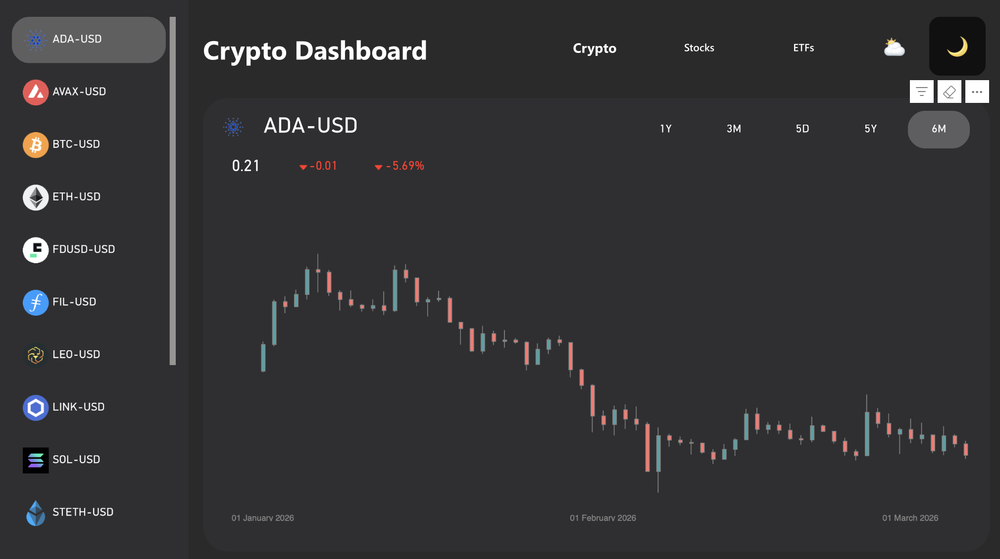
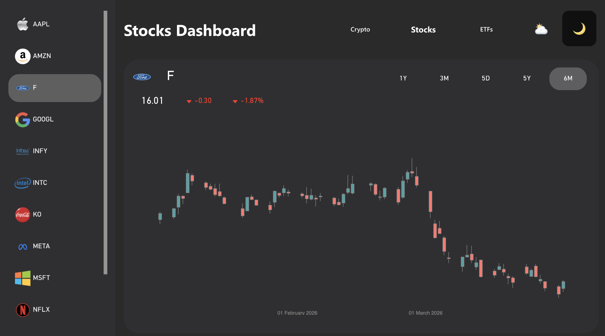
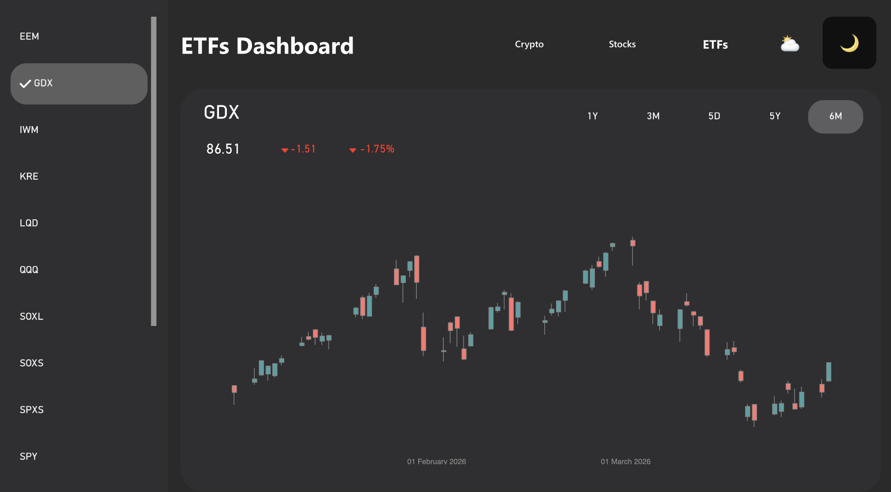
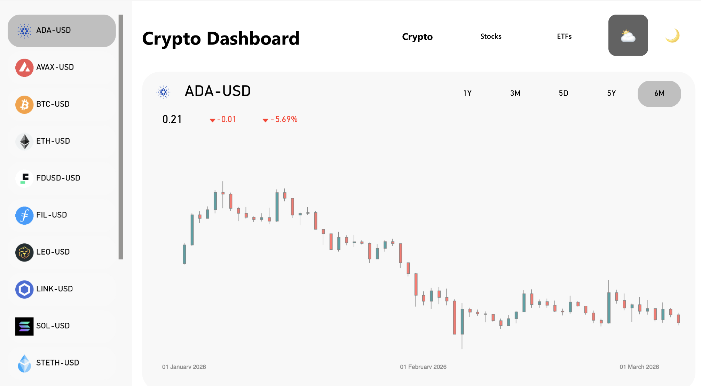

# 📈 AI-Powered Financial Market Analytics Platform | Python, MySQL, PySpark, Power BI & Groq LLM

<p align="center">
  <b>Real-Time Market Intelligence Platform for Stocks, Cryptocurrencies & ETFs</b>
</p>

A complete end-to-end financial analytics platform that combines **Python Data Engineering, MySQL, PySpark, Power BI, Web Development, and Generative AI** to provide real-time market intelligence.

The platform automatically fetches financial data from Yahoo Finance, stores it in structured datasets, performs advanced SQL and PySpark analytics, visualizes trends through Power BI dashboards, and enables users to interact with market data through an AI-powered assistant built using Groq LLM.

Unlike traditional dashboards, this solution allows users to ask natural language questions and receive data-driven answers backed by dynamically generated SQL queries.

---

# 🎯 Project Objectives

The project was built to solve real-world financial analytics challenges by providing:

✅ Real-Time Market Monitoring

✅ Historical Trend Analysis

✅ Stock Performance Analytics

✅ Cryptocurrency Market Insights

✅ ETF Performance Tracking

✅ Interactive Power BI Reporting

✅ AI-Powered Natural Language Querying

✅ Automated Data Pipeline Refresh

✅ Dark & Light Theme Dashboard Experience

✅ Financial Forensics & Trend Discovery

---

# 🏗️ Tech Stack

## Data Engineering

* Python
* Pandas
* Yahoo Finance API (yFinance)

## Database

* MySQL

## Big Data Processing

* PySpark

## Business Intelligence

* Power BI

## AI Layer

* Groq LLM
* SQL Agent
* Natural Language to SQL Engine

## Frontend

* React
* JavaScript
* HTML
* CSS

## Backend

* JavaScript

## Version Control

* Git
* GitHub

---

# ⚙️ System Architecture

The project follows an automated analytics workflow:

### Data Pipeline

1. Python fetches latest market data from Yahoo Finance.
2. Data is stored in CSV files.
3. Python automatically creates MySQL tables.
4. Data is loaded into MySQL.
5. PySpark performs large-scale analytical transformations.
6. Power BI connects directly to Python-generated datasets.
7. Dashboard refresh automatically pulls latest market data.
8. Groq LLM interacts with database metadata.
9. User questions are converted into SQL queries.
10. Query results are returned as insights, trends, and forensic analysis.

---

# 📊 Market Coverage

The platform tracks multiple asset classes.

### Stocks

* Apple (AAPL)
* Microsoft (MSFT)
* Amazon (AMZN)
* Google (GOOGL)
* Meta (META)
* Netflix (NFLX)
* Intel (INTC)
* Infosys (INFY)
* Ford (F)

and more...

### Cryptocurrencies

* Bitcoin (BTC)
* Ethereum (ETH)
* Solana (SOL)
* Cardano (ADA)
* Avalanche (AVAX)
* Chainlink (LINK)
* Filecoin (FIL)

and more...

### ETFs

* SPY
* QQQ
* SOXL
* SOXS
* IWM
* EEM
* GDX

and more...

---

# 🌙 Dashboard Features

### Theme Switching

The dashboard supports:

* Dark Mode
* Light Mode

Users can switch themes instantly without reloading data.

---

# 📈 Dashboard Screenshots

<h2 align="center">₿ Crypto Dashboard (Dark Mode)</h2>

<p align="center">
  
</p>

Features:

* Scrollable sidebar listing all tracked crypto symbols
* Candlestick chart with green (bullish) and red (bearish) candles
* Current price, absolute change, and percentage change displayed
* Timeframe selector — 1Y, 3M, 5D, 5Y, 6M
* Dark/Light theme toggle button in the top-right corner

---

<h2 align="center">📊 Stocks Dashboard (Dark Mode)</h2>

<p align="center">
  
</p>

Features:

* Scrollable sidebar with company logos and stock ticker symbols
* Candlestick chart showing selected stock's price history
* Current price, absolute change, and percentage change displayed
* Timeframe selector — 1Y, 3M, 5D, 5Y, 6M
* Active selection highlighted in the sidebar

---

<h2 align="center">📈 ETFs Dashboard (Dark Mode)</h2>

<p align="center">
  
</p>

Features:

* Scrollable sidebar listing all tracked ETF symbols
* Candlestick chart for selected ETF
* Current price, absolute change, and percentage change displayed
* Timeframe selector — 1Y, 3M, 5D, 5Y, 6M

---

<h2 align="center">☀️ Crypto Dashboard (Light Mode)</h2>

<p align="center">
  
</p>

Features:

* Full light theme applied across sidebar, chart, and header
* Same layout and functionality as dark mode
* Theme toggle button in the top-right corner to switch back

---

# 🤖 AI Financial Assistant

One of the core features of the platform is the integrated AI Assistant powered by Groq LLM.

### Capabilities

✅ Natural Language Querying

✅ SQL Query Generation

✅ Trend Analysis

✅ Financial Forensics

✅ Market Intelligence

✅ Historical Performance Analysis

✅ Sector-Level Insights

✅ Asset Comparison

### Example Questions

* Which stock generated the highest return this month?
* Compare Bitcoin and Ethereum performance over the last 90 days.
* Which ETF has the lowest volatility?
* What assets are currently showing bullish trends?
* Explain why Tesla declined last week.
* Show top gainers and losers.
* Identify unusual market movements.

The assistant automatically generates SQL queries, executes them against MySQL, and explains the results in plain English.

---

# 📌 Business Insights Delivered

The platform enables:

### Trend Discovery

* Short-Term Trends
* Long-Term Trends
* Momentum Analysis
* Moving Average Studies

### Market Forensics

* Price Shock Detection
* Volatility Analysis
* Outlier Identification
* Market Event Correlation

### Portfolio Intelligence

* Asset Comparison
* Performance Ranking
* Sector Rotation Analysis
* Risk Assessment

---

# 🧠 Advanced MySQL Analytics Questions Solved

## 1. Top Performing Assets by Return

```sql
SELECT symbol,
ROUND(((MAX(close)-MIN(close))/MIN(close))*100,2) AS return_pct
FROM market_data
GROUP BY symbol
ORDER BY return_pct DESC;
```

## 2. Highest Volume Trading Days

```sql
SELECT date,
SUM(volume) total_volume
FROM market_data
GROUP BY date
ORDER BY total_volume DESC;
```

## 3. Most Volatile Assets

```sql
SELECT symbol,
STDDEV(close) volatility
FROM market_data
GROUP BY symbol
ORDER BY volatility DESC;
```

## 4. Average Daily Return

```sql
SELECT symbol,
AVG(close-open) avg_return
FROM market_data
GROUP BY symbol;
```

## 5. Top Gainers

```sql
SELECT symbol,
(close-open) gain
FROM market_data
ORDER BY gain DESC;
```

## 6. Top Losers

```sql
SELECT symbol,
(close-open) loss
FROM market_data
ORDER BY loss ASC;
```

## 7. Monthly Performance

```sql
SELECT MONTH(date),
AVG(close)
FROM market_data
GROUP BY MONTH(date);
```

## 8. Asset Ranking by Market Activity

```sql
SELECT symbol,
SUM(volume)
FROM market_data
GROUP BY symbol;
```

## 9. Moving Average Analysis

```sql
SELECT symbol,
AVG(close)
FROM market_data
GROUP BY symbol;
```

## 10. Peak Trading Sessions

```sql
SELECT date,
SUM(volume)
FROM market_data
GROUP BY date;
```

## 11. Asset Performance by Category

```sql
SELECT asset_type,
AVG(close)
FROM market_data
GROUP BY asset_type;
```

## 12. Maximum Drawdown

```sql
SELECT symbol,
MIN(close)
FROM market_data
GROUP BY symbol;
```

## 13. Bullish Assets

```sql
SELECT symbol
FROM market_data
WHERE close > open;
```

## 14. Bearish Assets

```sql
SELECT symbol
FROM market_data
WHERE close < open;
```

## 15. Best Asset by Risk-Adjusted Return

```sql
SELECT symbol,
AVG(close)/STDDEV(close)
FROM market_data
GROUP BY symbol;
```

---

# ⚡ Advanced PySpark Analytics Questions Solved

## 1. Calculate Daily Returns

```python
df.withColumn(
    "daily_return",
    (col("Close")-col("Open"))/col("Open")
)
```

## 2. Rolling 30-Day Average

```python
avg("Close").over(windowSpec)
```

## 3. Top Volume Assets

```python
df.groupBy("Symbol").sum("Volume")
```

## 4. Volatility Calculation

```python
df.groupBy("Symbol").agg(stddev("Close"))
```

## 5. Monthly Aggregation

```python
df.groupBy(month("Date"))
```

## 6. Moving Average Trend Detection

```python
lag("Close")
```

## 7. Bullish Pattern Detection

```python
filter(col("Close") > col("Open"))
```

## 8. Bearish Pattern Detection

```python
filter(col("Close") < col("Open"))
```

## 9. Top Gainers

```python
orderBy(desc("daily_return"))
```

## 10. Top Losers

```python
orderBy("daily_return")
```

## 11. Asset Ranking

```python
dense_rank()
```

## 12. Market Breadth Analysis

```python
countDistinct("Symbol")
```

## 13. Volume Spike Detection

```python
col("Volume") > avg_volume
```

## 14. ETF Performance Comparison

```python
groupBy("ETF")
```

## 15. Sector Performance Analysis

```python
groupBy("Sector")
```

---

# 🚀 Power BI Integration

Power BI is connected directly to Python-generated datasets.

When Power BI refreshes:

1. Python fetches latest Yahoo Finance data.
2. CSV files are updated automatically.
3. New market records are generated.
4. Dashboards refresh with latest information.

No manual data loading is required.

---

# 🌐 Web Application & AI Assistant Demo

An interactive web application was built on top of the analytics platform, bringing the dashboard and AI assistant into the browser.

## 🖥️ Website

The web app displays live market charts and asset data across Stocks, Crypto, and ETFs — powered by a Flask backend connected to the same MySQL database.

## 🤖 Groq LLM Chatbot

Users can type any market-related question in plain English. The Groq LLM converts it to SQL, executes it on the database, and returns the result along with the query used — making the data fully conversational.

## 🎥 Demo Video

Watch the full platform walkthrough including the web dashboard and AI assistant:

[](https://www.loom.com/share/your-video-id-here)

> 🔗 **Loom Link:** [https://www.loom.com/share/your-video-id-here](https://www.loom.com/share/your-video-id-here)

---

# ⭐ Project Highlights

* Real-Time Financial Data Pipeline
* Automated Yahoo Finance Integration
* MySQL Data Warehouse
* Advanced SQL Analytics
* PySpark Transformations
* Interactive Power BI Dashboards
* Light & Dark Theme Support
* AI-Powered Financial Assistant
* Natural Language to SQL Engine
* Financial Forensics & Trend Discovery
* Stocks, Crypto & ETF Analytics
* End-to-End Data Engineering Workflow

---
